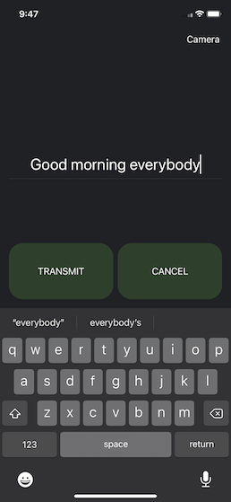

# Morse Code Flashlight Android App
## Download the Android App
* [Google Play](https://play.google.com/store/apps/details?id=com.wpeery.morsecodeflashlight)

## Android Instructions
There are two components to this app, transmitting and decoding, each with their separate view.

For transmitting enter a message into the text box and hit the 'transmit' button. The flashlight will transmit the message as Morse code. The transmission can be cancelled at any time by hitting the 'cancel' button.

For decoding, hit the 'Camera' button at the top right to be taken to the camera view. Press and hold the record button to start decoding a Morse code message. Release the record button to stop decoding and the decoded message will appear on the screen.

This app is intended to be used for two people to communicate with Morse code. One person can transmit a message with their flashlight and the other person can use their camera to  decode the message.

# Morse Code Camera IOS App
## Download the IOS App
* [App Store](https://apps.apple.com/app/morse-code-camera/id1670550522)

## Screen Shots

   

## IOS Instructions

There are two components to this app, transmitting and decoding, each with their separate view.

For transmitting enter a message into the text box and hit the 'transmit' button. The flashlight will transmit the message as Morse code. The transmission can be cancelled at any time by hitting the 'cancel' button.

For decoding, hit the 'Camera' button at the top right to be taken to the camera view. Press the record button to start decoding a Morse code message. The decoded message will appear on the screen. Press the record button again to stop decoding.

This app is intended to be used for two people to communicate with Morse code. One person can transmit a message with their flashlight and the other person can use their camera to  decode the message. However, it is possible to test the app with a single device. Point the device at a wall or reflective surface and transmit a message. Then quickly switch to the camera view and start recording while the flashlight is still transmitting the message. The app should be able to decode most of the message except for the first word which may not get fully captured.

[Android Privacy Policy](privacy_policy.md)
[IOS Privacy Policy](privacy_policy_ios.md)
